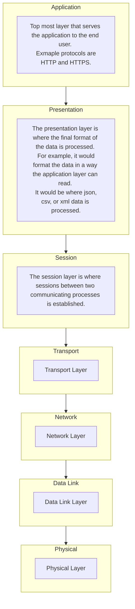

As I look to purchase a new router, I wanted to be reminded of what the latest standards (Wi-Fi 7) actually introduce compared to the other 802.11 standards.

I'm also hoping this will save me time in 5 years when Wi-Fi 8 routers hit the market. 

# What is 802.11?

- The first wireless technology standard
- Defined wireless connectivity at 1Mbps and 2Mpbs within a LAN
- Applied to layers 1 and 2 of the OSI Model

