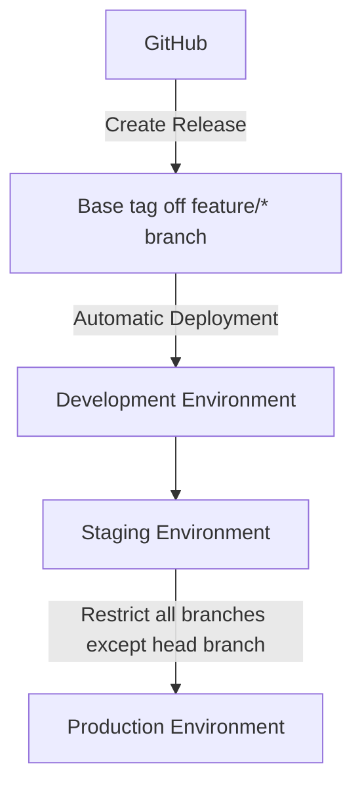
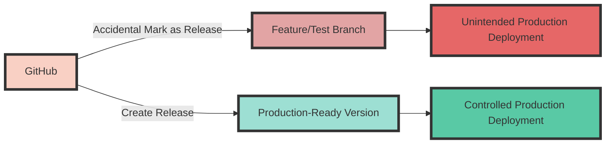
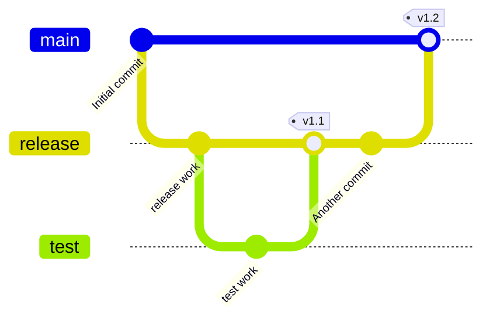

# Locking Down Tag-Based Releases from Environments

As a DevOps engineer, I've always found tag-based releases to be a powerful tool for managing deployments across multiple environments. They offer a level of precision and control that's hard to match. But the challenge lies in ensuring that only the right branches - those that are production-ready - get deployed in a CI/CD pipeline. Let's dive into how GitHub's release feature can help us streamline this process. With GitHub, you can create a "release" which creates a tag that can be automatically deployed through the environments. But what if you want to restrict certain branches from being deployed to specific environments, like production?



Let's say you have a feature branch that you want to test in a staging environment, but you don't want it to go to production. This is where you can leverage GitHub Actions to control the flow of your deployments.

## Option 1: Navigating the PreRelease and Release Waters
GitHub's "prerelease" and "release" options can seem like a handy way to steer deployments. Marking a release as "prerelease" can help differentiate production-ready versions from others.

But this method does have a catch: It's too easy for someone to accidentally mark a feature or test branch as a "release", leading to an unintended production deployment.

So, while "prereleases" can be a tool in your deployment strategy, they're not a failsafe for controlling deployments to specific environments.




## Option 2: Using Git to Determine Tag and Branch Relationship
The `git branch --contains tags/$tag` command can identify branches associated with a specific tag. However, it has limitations. If a branch merges into master and a tag is created, the command will indicate the tag contains the master branch due to shared commit history.

This could result in deploying code that doesn't match the current master branch state, especially if additional commits were added post-merge. Conversely, this can be useful for rollbacks to a previous code state.

In summary, while this command provides useful information, it's not foolproof for ensuring a tag matches a specific branch's current state. Use it cautiously in deployment processes.




## Option 3: Using GitHub Action's Event Trigger to Identify the Original Branch of a Tag

You can use GitHub Actions to trigger events based on repository activity, such as a release being published. By accessing the `github.event.release.target_commitish` and `github.event.repository.default_branch` variables, you can determine the original branch of a tag.

The `github.event.release.target_commitish` specifies the commitish (branch) value that determines where the Git tag is created from. The `github.event.repository.default_branch`` is the default branch of the repository and can be used to compare with the tag's original branch.

This method allows you to restrict deployments to production based on the original branch of a tag. Specifically, you can check if the tag's original branch matches the repository's default branch before deploying to production.

Here's a sample release workflow that demonstrates this approach:

```yml
name: Release

on:
  release:
    types:
      - published
jobs:
  Build: 
    runs-on: ubuntu-latest
    steps:
      - name: Build
        run: |
          # Build Commands
          echo "Building app..."
  Deploy-To-Staging:
    runs-on: ubuntu-latest
    needs: [Build]
    environment:
      name: Staging
    steps:
      - name: Get variables
        run: |
            echo ${{ github.event.release.target_commitish }}
            echo ${{ github.event.repository.default_branch }}

  Deploy-To-Production:
    runs-on: ubuntu-latest
    needs: [Build, Deploy-To-Staging]
    if: ${{ github.event.release.target_commitish == github.event.repository.default_branch }}
    environment:
      name: Production
    steps:
      - name: Get Event
        run: cat $GITHUB_EVENT_PATH
```